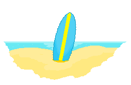

<p align="center">
	
	<br />
	
</p>

Surfs is a library for creating user interfaces in [Slack](https://api.slack.com/) applications. It aims to make creating Slack [surfaces](https://api.slack.com/surfaces) enjoyable.

## Table of Contents

- [Rationale](#rationale)
- [Using Surfs](#using-surfs)
    - [Component reference](doc/components.md)
    - [API Docs](#)
    - [Rendering components](#rendering-components)
    - [Defining custom components](#defining-custom-components)
    - [Children](#children)
- [Acknowledgements](#acknowledgements)

## Rationale

Slack's [Block Kit](https://api.slack.com/block-kit) is great! Writing blocks as hash maps is less great! Writing vectors is better! The goal of Surfs is to be a high quality template library for defining the user interface of a Slack application. It should be:

* Familiar - Like [hiccup](https://github.com/weavejester/hiccup), [reagent](https://github.com/reagent-project/reagent), and [rum](https://github.com/tons)
* Spec driven
    * There are specs for the whole block kit!
    * Detailed validation messages given via [expound](https://github.com/bhb/expound)
    * Learn about components through their specs!
* Easier than writing hash maps
* Easier to create reusable templates

## Using Surfs

Surfs renders Slack blocks, elements, and composition objects from vectors. It also
supports defining and using custom components (to organize and encapsulate Slack elements).

### Rendering components

The heart of Surfs is the `render` function.

```clojure
(require '[thlack.surfs :as surfs])

(surfs/render [:button {:action_id "A123"} "Click Me!"])

({:action_id "A123", 
  :type :button,
  :text {:type :plain_text, :text "Click Me!"}})

(surfs/render [:section {:block_id "B123"}
                [:text "Important Text"]]
              [:section {:block_id "B456"}
                [:markdown "# More Text!"]])

({:block_id "B123",
  :type :section,
  :text {:type :plain_text, :text "Important Text"}}
 {:block_id "B456",
  :type :section,
  :text {:type :mrkdwn, :text "# More Text!", :verbatim false}})
```

The results of render are typically attached to a Slack API payload in the `blocks` attribute.

```clojure
(require '[thlack.surfs :as surfs])
(require '[clojure.data.json :as json])

(let [blocks (surfs/render
              [:section {:block_id "B123"}
                [:text "Important Text"]]
              [:section {:block_id "B456"}
                [:markdown "# More Text!"]])]
  (post-message some-token (json/write-string {:channel "C123"
                                               :blocks  blocks})))
```

### Defining custom components

Custom components can be defined two different ways:

* As a function
* Using the `defc` macro

```clojure
;;; Using a function

(defn greeting
  [first-name]
  [:text (str "Hello " first-name "!")])

;;; Using defc

(defc greeting
  [first-name]
  [:text (str "Hello " first-name "!")])
```

Both types of custom component can be used in the head position of a vector
within a group of components.

```clojure
(render [:section {:block_id "B123"}
         [greeting "Brian"]])
```

Custom components defined via `defc` can be called as render functions themselves:

```clojure
(defc greeting
  [first-name]
  [:text (str "Hello " first-name "!")])

(greeting "Brian")
```

### Children

Children are one or more nested components - such as `:option` elements placed in a `:static-select`.

```clojure
[:static-select {:action_id "A123"}
  [:placeholder "Choose a topping"]
  [:option {:value "pepperoni"} "Pepperoni"]
  [:option {:value "pineapple"} "Pineapple"]]
```

If a child is encountered as a sequence, it will be flattened. This is useful for things like generating options:

```clojure
[:static-select {:action_id "A123"}
  [:placeholder "Options"]
  (map (fn [value label] [:option {:value value} label]) data)]
```

Or separating items:

```clojure
[:home
 (drop 1 (interleave (repeat [:divider])  [[:section {:block_id "1"}
                                            [:text "One!"]]
                                           [:section {:block_id "2"}
                                            [:text "Two!"]]
                                           [:section {:block_id "3"}
                                            [:text "Three!"]]]))]
```

## Acknowledgements

Concepts are borrowed from and inspired by the following libraries:

* [Hiccup](https://github.com/weavejester/hiccup)
* [Reagent](https://github.com/reagent-project/reagent)
* [Rum](https://github.com/tonsky/rum)

Many thanks to these authors and contributors.

## License

Copyright © 2020 Brian Scaturro

Distributed under the Eclipse Public License (see [LICENSE](LICENSE))
